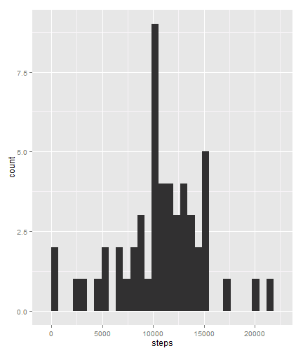
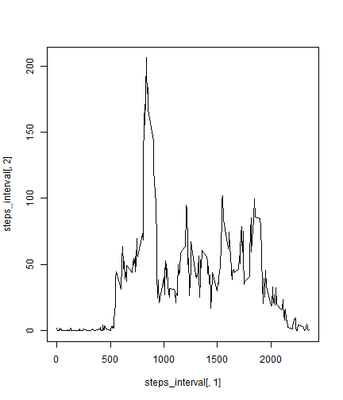
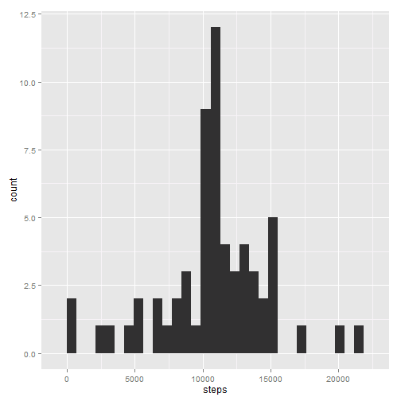

Peer Assessment 1 - Reproducible Research
========================================================

# Reproducible Research: Peer Assessment 1

## Loading and preprocessing the data

```r
library(ggplot2)
```

```
## Warning: package 'ggplot2' was built under R version 3.1.1
```

```r
temp = tempfile()
download.file("http://d396qusza40orc.cloudfront.net/repdata%2Fdata%2Factivity.zip", temp)
pdata = read.csv(unz(temp, "activity.csv"), colClasses = c("numeric", "Date", "numeric"))
```


## What is mean total number of steps taken per day?

```r
steps_day <- aggregate(steps ~ date, pdata, sum)  
ggplot(steps_day, aes(x=steps)) + geom_histogram()
```

```
## stat_bin: binwidth defaulted to range/30. Use 'binwidth = x' to adjust this.
```

 

```r
day_ave = mean(steps_day[,2])
day_median = median(steps_day[,2])
```


## What is the average daily activity pattern?

```r
steps_interval <- aggregate(steps ~ interval, pdata, mean)
plot(steps_interval[,1],steps_interval[,2], type = "l")
```

 

```r
interval_max = max(steps_interval[,2])
```


## Imputing missing values

```r
# Number of missing values
miss_rows = is.na(pdata$steps)
tot_miss_rows = dim(pdata)[1] - table(miss_rows)[1]

# Filling in values
interval_mean = rep(steps_interval[,2],61)

# Create a new dataset
pdata$steps[miss_rows] =  interval_mean[miss_rows]

# Make a histogram of the total number of steps taken each day and Calculate and report the mean and median total number of steps taken per day.
steps_day <- aggregate(steps ~ date, pdata, sum)  
ggplot(steps_day, aes(x=steps)) + geom_histogram()
```

```
## stat_bin: binwidth defaulted to range/30. Use 'binwidth = x' to adjust this.
```

 

```r
day_ave = mean(steps_day[,2])
daymedian = median(steps_day[,2])
```

The new mean is 1.0766 &times; 10<sup>4</sup> and the median is 1.0765 &times; 10<sup>4</sup> after filling in the incomplete rows. 

## Are there differences in activity patterns between weekdays and weekends?

```r
log_vec= (weekdays(pdata$date) == "Sunday" | weekdays(pdata$date) == "Saturday")
week = factor(log_vec, labels = c("weekday", "weekend"))
```


